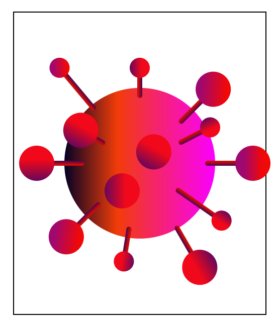

# CSS Art/ Corona_CSS

During the pandemic, I tutored an entry-level course on website basics. To make the exercises more exciting, I proposed that the students could showcase their skills by creating a small art project using only HTML and CSS. The image below was my take on the task.

